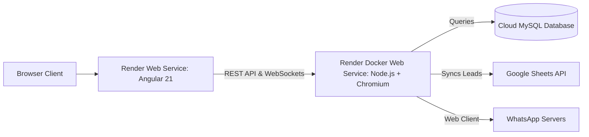

# Deploying Kezza Lead Management System to Render

This comprehensive guide walks you through deploying both the **WhatsApp Backend** (Node.js + Chromium/Puppeteer + WebSockets + Google Sheets) and the **Frontend** (Angular 21) onto [Render](https://render.com).

---

## Architecture Overview



---

## Prerequisites

1. A free account on [Render.com](https://render.com).
2. A GitHub account with this repository pushed.
3. A cloud MySQL database (free options: [Aiven](https://aiven.io), [TiDB Cloud](https://tidbcloud.com), or [Clever Cloud](https://www.clever-cloud.com)).
4. Your Google Cloud Service Account JSON file (`credentials.json`).

---

## Step 1: Set up Cloud MySQL Database

Render natively provides PostgreSQL, but your backend uses MySQL. You can use any free managed MySQL service (e.g., Aiven or TiDB Cloud):

1. Create a MySQL database instance.
2. Create database named `lead_management_system`.
3. Import your MySQL tables (`users`, `ads`, `contacts`, `messages`, etc.).
4. Note down the connection parameters:
   - **Host**: e.g., `mysql-xxxx.aivencloud.com`
   - **Port**: e.g., `3306` (or custom port like `15234`)
   - **User**: e.g., `avnadmin`
   - **Password**: `your_password`
   - **Database**: `lead_management_system`
   - **SSL**: `true`

---

## Step 2: Deploy Backend to Render (Docker Web Service)

> [!IMPORTANT]
> The backend uses `whatsapp-web.js`, which requires Chromium. Render's standard Node runtime lacks system Chromium packages, so the backend **must be deployed using Docker** (we have provided a preconfigured [Dockerfile](file:///Users/ravikumar/Desktop/Kezza_Lead_Management_System/Whatsapp-Backend/Dockerfile)).

1. Log in to [dashboard.render.com](https://dashboard.render.com).
2. Click **New +** → **Web Service**.
3. Select **Build and deploy from a Git repository** and choose your repository.
4. Fill in the service details:
   - **Name**: `kezza-whatsapp-backend`
   - **Root Directory**: `Whatsapp-Backend`
   - **Language / Runtime**: **Docker** (Render will automatically detect the `Dockerfile` inside `Whatsapp-Backend`).
   - **Region**: Select the region closest to you (e.g., Singapore, Oregon, Frankfurt).
   - **Instance Type**: Free (or Starter for production).
5. In **Environment Variables**, add:

| Key | Value | Description |
|---|---|---|
| `PORT` | `3000` | Backend port |
| `NODE_ENV` | `production` | Production mode |
| `DB_HOST` | `<your_cloud_mysql_host>` | Cloud MySQL Hostname |
| `DB_PORT` | `3306` | Cloud MySQL Port |
| `DB_USER` | `<your_cloud_mysql_user>` | Cloud MySQL Username |
| `DB_PASSWORD` | `<your_cloud_mysql_password>` | Cloud MySQL Password |
| `DB_NAME` | `lead_management_system` | Database Name |
| `DB_SSL` | `true` | Enable SSL for cloud DB |
| `GOOGLE_CREDENTIALS_JSON` | `{"type": "service_account", ...}` | Paste entire contents of `credentials.json` |

6. Click **Create Web Service**.
7. Wait for the build to finish. Once live, copy your backend URL (e.g., `https://kezza-whatsapp-backend.onrender.com`).

---

## Step 3: Configure & Deploy Frontend to Render

### 3.1 Point Frontend to Production Backend URL

In [Whatsapp-Frontend/src/environments/environment.prod.ts](file:///Users/ravikumar/Desktop/Kezza_Lead_Management_System/Whatsapp-Frontend/src/environments/environment.prod.ts), update the URLs with your actual Render backend URL:

```typescript
export const environment = {
  production: true,
  apiUrl: 'https://kezza-whatsapp-backend.onrender.com', // Replace with your Render Backend URL
  wsUrl: 'wss://kezza-whatsapp-backend.onrender.com'     // Use wss:// for secure WebSockets
};
```

Commit and push these changes to GitHub:
```bash
git add .
git commit -m "Update production backend URL"
git push origin main
```

### 3.2 Deploy Frontend Web Service

1. On [dashboard.render.com](https://dashboard.render.com), click **New +** → **Web Service**.
2. Select your repository.
3. Configure:
   - **Name**: `kezza-whatsapp-frontend`
   - **Root Directory**: `Whatsapp-Frontend`
   - **Language / Runtime**: **Node**
   - **Build Command**: `npm install && npm run build`
   - **Start Command**: `npm run serve:ssr:whatsapp-frontend`
   - **Instance Type**: Free
4. In **Environment Variables**, add:
   - `NODE_VERSION`: `20.18.0`
5. Click **Create Web Service**.
6. Once deployed, open your frontend URL (e.g., `https://kezza-whatsapp-frontend.onrender.com`).

---

## Alternative: 1-Click Deployment with Render Blueprint (`render.yaml`)

We have included a [render.yaml](file:///Users/ravikumar/Desktop/Kezza_Lead_Management_System/render.yaml) file in the root directory.

1. In Render Dashboard, click **Blueprints** → **New Blueprint Instance**.
2. Select your repository.
3. Render will automatically read `render.yaml` and set up both frontend and backend services.
4. Fill in the secret environment variables (`DB_HOST`, `DB_PASSWORD`, `GOOGLE_CREDENTIALS_JSON`).
5. Click **Apply**.

---

## Crucial Tips for WhatsApp Web on Render

> [!TIP]
> **Free Tier Sleep Behavior**: Render's free tier services spin down after 15 minutes of inactivity. When the backend spins down, the active WhatsApp Web browser process stops.
> - For continuous 24/7 operation, upgrade the backend to Render's **Starter Plan ($7/mo)** and attach a **Persistent Disk** (mounted at `/usr/src/app/.wwebjs_auth`) so login sessions survive restarts without re-scanning QR codes.
> - Alternatively, keep the free service awake by pinging `https://kezza-whatsapp-backend.onrender.com` every 10 minutes using a free uptime monitor like [UptimeRobot](https://uptimerobot.com) or [Cron-job.org](https://cron-job.org).
